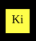
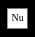
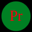

# JS-Particle-System
A simple particle system implemented in JavaScript


## Running
Either visit the site [here](https://evanpblack.com)
or clone the project and open index.html.
Any reasonably modern browser should work.

## Tests
Running the tests requires Node.

Run the tests by executing:
```bash
node test.js
```
or
```bash
nodejs test.js
```
depending on your platform.

## Rules
The system is made up of _particles_ and _actors_
each with their own rules.

The system operates on ticks. Every animation update is one tick.

Random [Explosion] actors may be generated by the system if that option is set.

### Particles


Particles are the basic unit of the system. They:
  * Move within the space and collide with other particles & actors
    * When a collision occurs between two particles. One absorbs another
    * When a collision occurs between a particle and an actor the particle will bounce off
    or the specific rules of that actor apply
  * When one particle absorbs another it will grow
    * When a particle exceeds a certain radius, it will burst into smaller particles

### Actors

#### Explode Actor


Explode actors explode after making contact with a particle, and a set amount of time passes.
When the actor explodes, any particle in the explosion radius is killed.

#### Kill Actor


Kill actors remove any particle that it comes in contact with.
The actor will remove only a set number of particles before becoming a Null actor.

#### Null Actor


Null actors do nothing. Particles will still bounce off of them with no effect.

#### Producer Actor


Producer actors create new particles that are inserted into the system after a set number of ticks.
Producer actors will continuously produce particles for as long as the simulation is run.